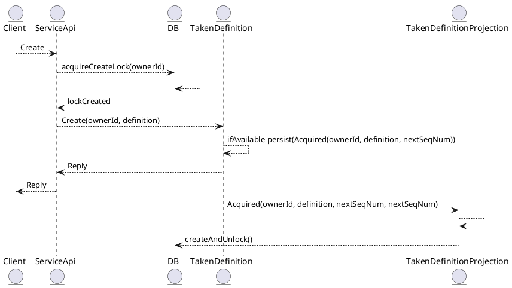
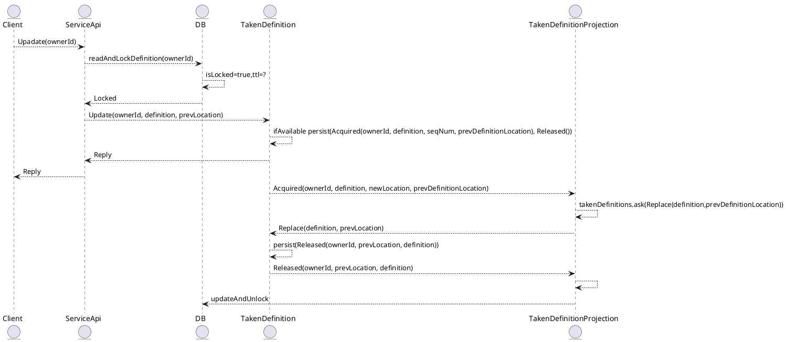

### Create path

```plantuml
@startuml

entity Client

entity ServiceApi

entity DB

entity TakenDefinition

entity TakenDefinitionProjection

Client --> ServiceApi : Create
ServiceApi --> DB: acquireCreateLock(ownerId)
DB --> DB 
DB --> ServiceApi: lockCreated

ServiceApi --> TakenDefinition: Create(ownerId, definition)

TakenDefinition --> TakenDefinition: ifAvailable persist(Acquired(ownerId, definition, nextSeqNum))  
TakenDefinition --> ServiceApi : Reply 
ServiceApi --> Client: Reply


TakenDefinition --> TakenDefinitionProjection: Acquired(ownerId, definition, nextSeqNum, nextSeqNum)

TakenDefinitionProjection --> TakenDefinitionProjection
TakenDefinitionProjection --> DB: createAndUnlock() 
 

@enduml
```

### Update path

```plantuml
@startuml

entity Client

entity ServiceApi

entity DB

entity TakenDefinition

entity TakenDefinitionProjection

Client --> ServiceApi : Upadate(ownerId)

ServiceApi --> DB: readAndLockDefinition(ownerId)

DB --> DB: isLocked=true,ttl=?
 
DB --> ServiceApi: Locked

ServiceApi --> TakenDefinition: Update(ownerId, definition, prevLocation)

TakenDefinition --> TakenDefinition: ifAvailable persist(Acquired(ownerId, definition, seqNum, prevDefinitionLocation), Released())  

TakenDefinition --> ServiceApi : Reply 
ServiceApi --> Client: Reply

TakenDefinition --> TakenDefinitionProjection: Acquired(ownerId, definition, newLocation, prevDefinitionLocation)
TakenDefinitionProjection --> TakenDefinitionProjection: takenDefinitions.ask(Replace(definition,prevDefinitionLocation))

TakenDefinitionProjection --> TakenDefinition: Replace(definition, prevLocation) 
                                                           
TakenDefinition --> TakenDefinition : persist(Released(ownerId, prevLocation, definition))  
TakenDefinition --> TakenDefinitionProjection: Released(ownerId, prevLocation, definition)

TakenDefinitionProjection --> TakenDefinitionProjection 

TakenDefinitionProjection --> DB: updateAndUnlock 

@enduml
```

